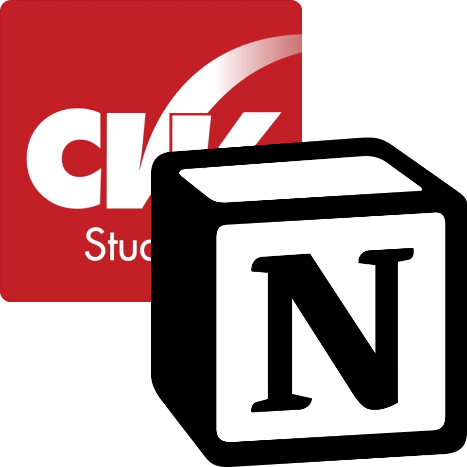

# CVV to Notion

Un'app Node.js per inviare l'agenda di Classeviva ad un Database di Notion. Basasto sul (fantastico) [Classeviva.js](https://github.com/47PADO47/Classeviva.js/).

## Features

- Copia dell'agenda di classeviva in un database di Notion.
- Controllo dell'esistenza di un entry prima di metterla
  - In pratica, ti consente di rieeseguire quante volte ti pare il programma senza avere 1000 duplicati (a meno che non sia stato modificato. In tal caso, dovrai rimuovere il duplicato manualmente)

Nota che il programma **non** è automatico: dovrai eseguirlo ogni xyz (o impostare un cron job che lo faccia per te) e aggiornerà l'agenda con i nuovi compiti/eventi. Nota che il programma è impostato in modo da copiare l'intera agenda così come è su classeviva, ma se puoi puoi modificarlo per includere solo i compiti (le caselle gialle, per intenderci) o gli altri eventi.
Questo è sconsigliato perchè i professori spesso non sanno usano questa funzione e rischi di perderti cose.

## Setup

### Notion

1. Segui [questa](https://developers.notion.com/docs/create-a-notion-integration) guida per creare un _integration_ e concedi l'accesso ad una **copia** di questo [questo database template](https://fabio53443.notion.site/3a3450e03cc64560adcad5139f191ab3). (tasto "Duplica" in alto a sx). Potrai aggiungere altre proprietà ma non modificare in nessun modo quelle già presenti, altrimenti il programma non funzionerà a dovere.
   1. ti consiglio di creare nuove view in notion, come calendario, etc.
2. Appunta la chive e l'id database (lo puoi recuperare dall'URL, copia fino a ?). Ti serviranno più tardi.

### Node

1. Installa Node.js e NPM (latest stable)
2. Clona la repo (o scarica lo zip) e apri un terminale nella cartella. 
3. `npm install` per installare tutte le dipendenze
4. `npm run setup` per impostare le variabili
5. `npm run sync` per eseguire effettivamente lo script (quello che poi eseguirai tutte le volte).
