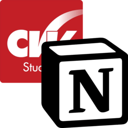
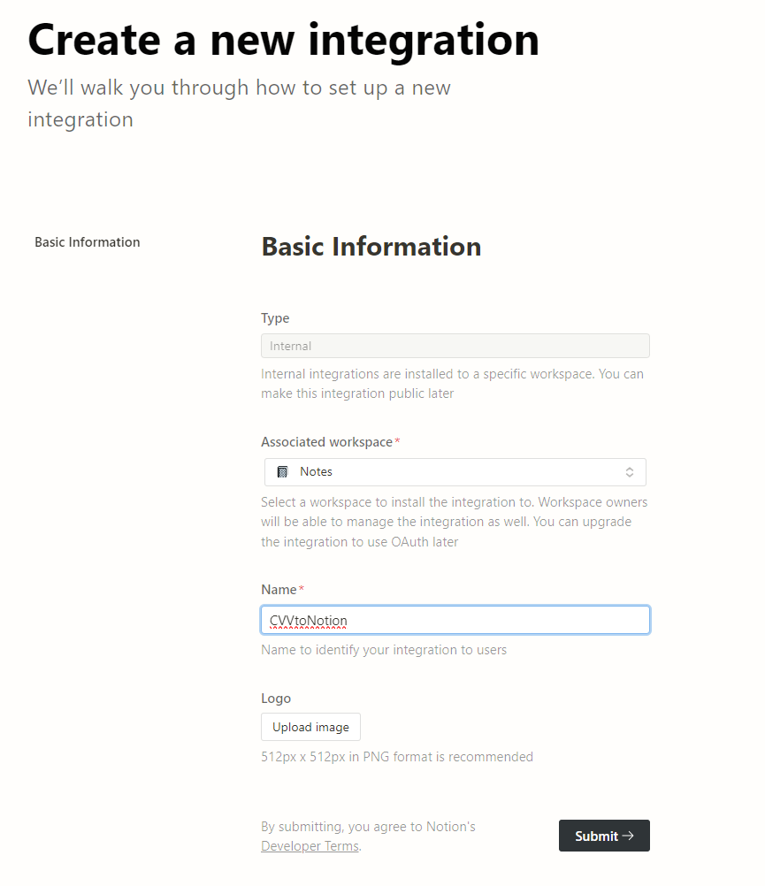
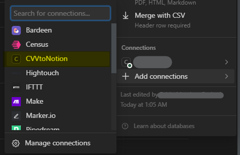

# CVV to Notion

Un'app Node.js per inviare l'agenda di Classeviva ad un Database di Notion. Basasto sul (fantastico) [Classeviva.js](https://github.com/47PADO47/Classeviva.js/).

## Features

- Copia dell'agenda di classeviva in un database di Notion.
- Controllo dell'esistenza di un entry prima di metterla
  - In pratica, ti consente di rieeseguire quante volte ti pare il programma senza avere 1000 duplicati (a meno che non sia stato modificato. In tal caso, dovrai rimuovere il duplicato manualmente)

Nota che il programma **non** è automatico: dovrai eseguirlo ogni xyz (o impostare un cron job che lo faccia per te) e aggiornerà l'agenda con i nuovi compiti/eventi. Nota che il programma è impostato in modo da copiare l'intera agenda così come è su classeviva, ma se vuoi puoi modificarlo per includere solo i compiti (le caselle gialle, per intenderci) o gli altri eventi.
Questo è sconsigliato perchè i professori spesso non sanno usano questa funzione e rischi di perderti cose.

## Setup

### Video tutorial
Grazie a [Gabbo144](https://github.com/Gabbo144) per questo tutorial: (yt: https://youtu.be/bw_Ae9YystY)

### Notion

1. Duplica [questo database template](https://fabio53443.notion.site/3a3450e03cc64560adcad5139f191ab3) nel tuo Workspace; Potrai aggiungere altre proprietà ma non modificare in nessun modo quelle già presenti, altrimenti il programma non funzionerà a dovere.
2. Vai su [questa](https://www.notion.so/my-integrations) pagine per creare un _integration_. Appunta la chiave che ti viene mostrata in quanto ti servirà successivamente
 
3. Concedi l'accesso alla copia del database che hai fatto.

4. Appunta l'id database (lo puoi recuperare dall'URL, copia dallo slash dopo il nome fino a ?: https://www.notion.so/nomeutente/`DBID`?v=xyz, sarebbe `DBID`)

### Node

1. Installa Node.js e NPM (latest stable)
2. Clona la repo (o scarica lo zip) e apri un terminale nella cartella.
3. `npm run setup` per scaricare tutte le dipendenze e impostare le variabili
4. `npm run sync` per eseguire effettivamente lo script e sincronizzare l'agenda (quello che poi eseguirai tutte le volte).
